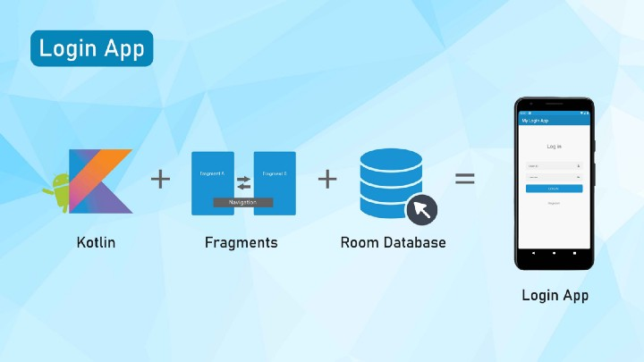

 

<!-- [)
[] -->

Login-Register App with Kotlin using Fragments and Room Database [MVVM Architecture] .The goal of this Template is to be our starting point for new projects, following the best development practices. Implimented Project Using  [MVVM architecture](https://developer.android.com/topic/architecture?gclsrc=ds) guidelines provided by Google. And [Room DataBase](https://developer.android.com/jetpack/androidx/releases/room?gclsrc=ds&gclsrc=ds) And Jetpack [Navigation](https://developer.android.com/guide/navigation?gclsrc=ds&gclsrc=ds).

## Main modules
The below are the considerations followed for this sample  project:
- MVVM
- Kotlin — Programming language
- Retrofit — API calls
- RoomDB — Local DB
- Kotlin Coroutines
- All JetPack Components

<!-- ## Tests
- [Mockk](https://mockk.io/) library 
- Unit tests
- Application tests
  - example on how to work with tests
- Activity tests (with [Compose Testing](https://developer.android.com/jetpack/compose/testing))
  - example on how to work with coroutine scopes in tests
    
## Other useful features
- This version brings [Modularization](https://developer.android.com/topic/modularization)
- Version Management (with [Version catalog](https://docs.gradle.org/current/userguide/platforms.html))
- Shared Build Logic (with [Convention plugins](https://docs.gradle.org/current/samples/sample_convention_plugins.html))
- Dependency injection (with [Hilt](http://google.github.io/hilt/))
- Network calls (with [Ktor](https://ktor.io/docs/http-client-engines.html#minimal-version))
- Reactive programming (with [Kotlin Flows](https://kotlinlang.org/docs/reference/coroutines/flow.html))
- Android architecture components to share ViewModels during configuration changes
- [Splash Screen](https://developer.android.com/develop/ui/views/launch/splash-screen) Support
- Google [Material Design](https://material.io/blog/android-material-theme-color) library
- Declarative UI (with [Jetpack Compose](https://developer.android.com/jetpack/compose))
  - Compose Navigation (with [Hilt Support](https://developer.android.com/jetpack/compose/libraries#hilt-navigation) and Assisted Inject Example)
- Edge To Edge Configuration

# Getting started

1. Download this repository extract and open the template folder on Android Studio
2. Rename the app package `io.bloco.template`
3. Check if the manifest package was renamed along with the package
4. Replace composables with the Template name
5. On `androidApp/build.gradle`, change the applicationId to the new app package
6. On `androidApp/build.gradle`, update the dependencies Android Studio suggests
7. On `string.xml`, set your application name

**If you run the Project inside the NewProjectCI all the above steps are done by you automatically, you can run the project using Android Studio then Opening the Main.kt file and press "Run MainKt". You will be prompted about a new package name and app name**

8. On `Theme.kt` & `Color.kt` set your application style
9. Replace the App Icons
10. Delete unwanted example files
11. Run `./gradlew dependencyUpdates` and check for dependencies
12. Ready to Use

And you're ready to start working on your new app.

# Notes
- Android Template contains `.github/workflows` for lint check, unit testing and dependency checks. You can easily take this project worflow and repurpose it with a few path changes, you can also find a commented example in test.yml for Instrumentation Testing and CodeCoverage that we advice to keep a clean project, you will however need to replace the secret keys with your own. -->
